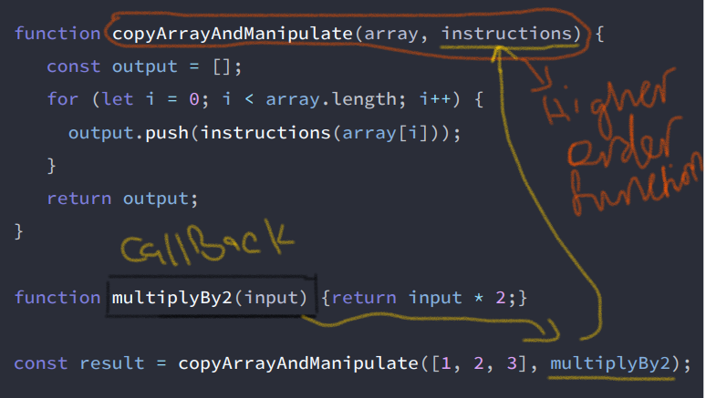

# Day 1: Introduction, JavaScript Principles, functions & callbacks.

This README file summarizes an introduction to the course, JavaScript Principles, functions & callbacks. 

## Lesson Summary
Here are the key points covered:

- Important JS princibles, like DRY (Don't repeat yourself).
- Excution Context, which as the following image shows, has 2 parts : Thread of Excution, Memory.

- Call stack, which keeps track of what function is currently running.
- Functions in JS  are actually treated like objects.
- Callbacks & Higher order functios: where the outer function that takes in or passes out a function is the higher order function, and the function we insert in is our callback function, as clarifies the example below:

- Arrow Functions : improve legibility of code.

the images below shows how to turn a function into an arrow function :


and there the callback function can be passed as an arrow function :


## Coding Exercises

### [Use Higher-Order Functions map, filter, or reduce to Solve a Complex Problem](https://www.freecodecamp.org/learn/javascript-algorithms-and-data-structures/functional-programming/use-higher-order-functions-map-filter-or-reduce-to-solve-a-complex-problem)

#### My Solution
```javascript

const squareList = arr => {
  // Only change code below this line
  arr = arr.filter(element => element > 0 && element % parseInt(element) === 0)
          .map(element => Math.pow(element, 2));
  return arr;
  // Only change code above this line
};

```
### [Concatenating Strings with the Plus Equals Operator](https://www.freecodecamp.org/learn/javascript-algorithms-and-data-structures/functional-programming/apply-functional-programming-to-convert-strings-to-url-slugs)

#### My Solution
```javascript

function urlSlug(title) {
  title = title.split(" ")
    .filter(substring => substring !== "") // getting red of spaces
    .join("-")
    .toLowerCase();
  return title;
}

```
### [Exercises for functions and callbacks](https://github.com/orjwan-alrajaby/gsg-expressjs-backend-training-2023/blob/main/learning-sprint-1/week2-day1-tasks/tasks.md)

#### My Solution
```javascript
// code is written in file : Code Assignments/functions_callbacks.js
```

