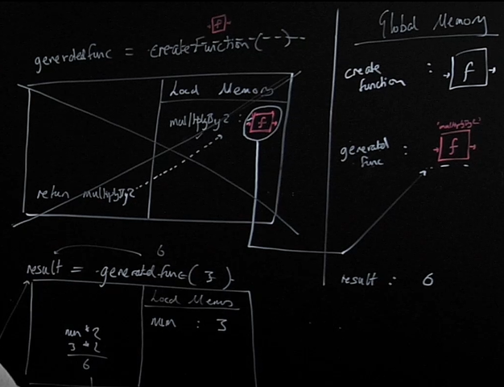

# Day 2: Closure.

This README file is a summary of Closure in JS . 

## Lesson Summary
Here are the key points covered:

- Closure enables powerful pro-level functions like ‘once’ and ‘memoize’

here, after creating the function generatedFunc, it has nothing to do with createFunction, though it was created with the help of createFunction.
By doing that the generated function is being used by it's global lable, the Generated Function gets a powerful properity in JS which is SCOPE, described in the following images:

By calling myNewFunction in this example, we create an excution context to it, where in the excution thread the counter++ in excuted to increase counter by 1, but looking at the local memory, counter cannot be found, and same as the global memory, 

Having the scope properity, meaning that all the surrounded data where stored with the generated function myNewFunction, and instead of looking or counter in the global memory, it can be found in the myNewFunction own memory & scope.

## Coding Exercises

### [Closures](https://github.com/orjwan-alrajaby/gsg-expressjs-backend-training-2023/blob/main/learning-sprint-1/week2-day2-tasks/tasks.md)

#### My Solution
```javascript
// code is written in file : Code Assignments/Closure.js
```

