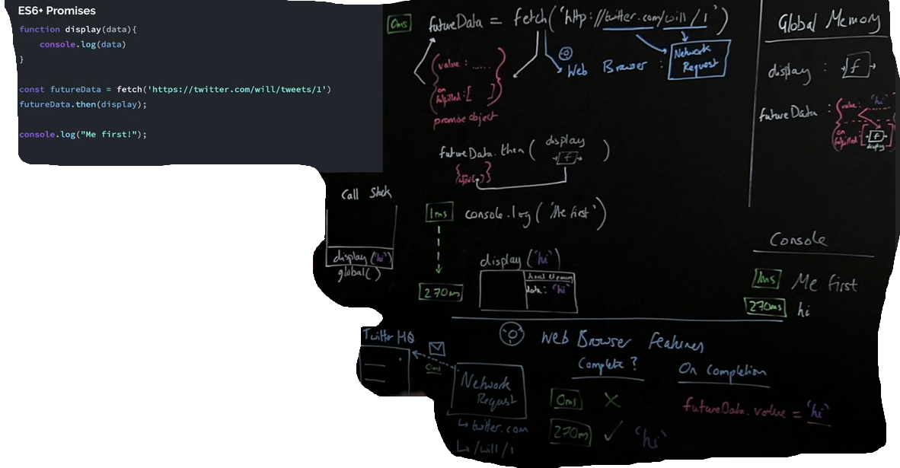

# Day 3: Async JS & Promises.

This README file summarizes Async JS & Promises. 

## Lesson Summary
Here are the key points covered:

- Asynchronicity - the feature that makes dynamic web applications possible
## Coding Example:


setTimeOut function is a web browser feature, after being excuted at 0ms, the printHello function is added to the callback queue,
waiting for it's turn to get pushed to the call stack, BUT when code is running synchronously, printHello will keep waiting till all synchronous code excution is done.
JS uses an event loop, to check whether the call stack is empty or not in order to bring the waiting printHello function in the queue.
- Promises :Initiate background web browser work and Return a placeholder object (promise) immediately in JavaScript .



here, fetch initiates a new object (promise object) that holds the returned data from the network request, saves it in "value" on completion,
.then : is a method that holds the display function, in which is saved in "onFullfiled".


in the following example, data will be displayed first since display is getting excecuted before printing hello world, explained as in the below photo: 


the event loop excutes what's in the microtask queue before excuting what's in the callback queue.


## Coding Exercises

### [Exercises for Async JS & Promises](https://github.com/orjwan-alrajaby/gsg-expressjs-backend-training-2023/blob/main/learning-sprint-1/week2-day3-tasks/tasks.md)

#### My Solution
```javascript
// code is written in file : Code Assignments/Async_promises.js
```

