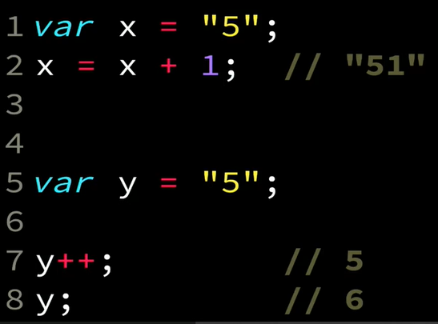
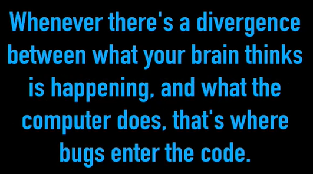
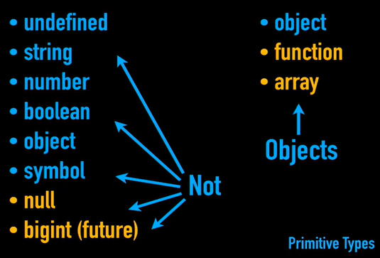

# Day 1: INTRO, Types.

This README file summarizes an introduction to JavaScript lesson types with an introduction. 

## Lesson Summary
Here are the key points covered:

### Intro :
- The importance of reading JS specifications (source of authority), Example:


in the code example above, if an error occured during compilation, then the reason must be the lack of understanding the language in depth, since the ++ op doesn't equal +1.

- best deffinition for bugs : 

 

getify laws #17

##### Course Pillars :
- Types
- Scope
- Objects

### Types: 
- Fact : not everything in JS is an object, in fact in JS specification it tells us that there are primitive types(like : undefined, string, number, boolean, object).
- 


- In JS values have types not variables.
- undeclared means a variable that has never been created, undefined means there's a variable but it doesn't have a value yet, uninitialized is a variable that hasn't been initialized like block scope ones.
- NaN : indecates an invalid number
- isNaN() tells if the given arguemnt possess the NaN value or not
- JS has a -0 which = to 0, but in other cases js has another opinion:
ex:
```javascript
0 === -0 //true
Object.is(-0,0); // false (ask about it Hadeel !)
```
## Coding Exercises

### [SECTION'S EXERCISES](https://github.com/orjwan-alrajaby/gsg-expressjs-backend-training-2023/blob/main/learning-sprint-1/week3-day1-tasks/tasks.md)

#### My Solution
```javascript
// in file Code Exercises/Day1_Assignments
```
